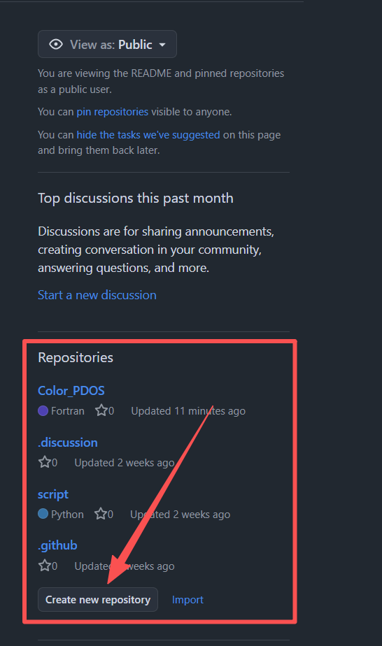
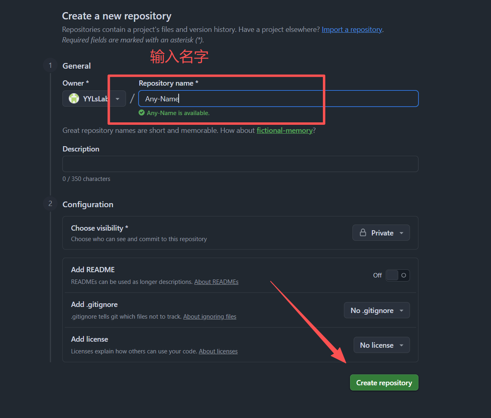
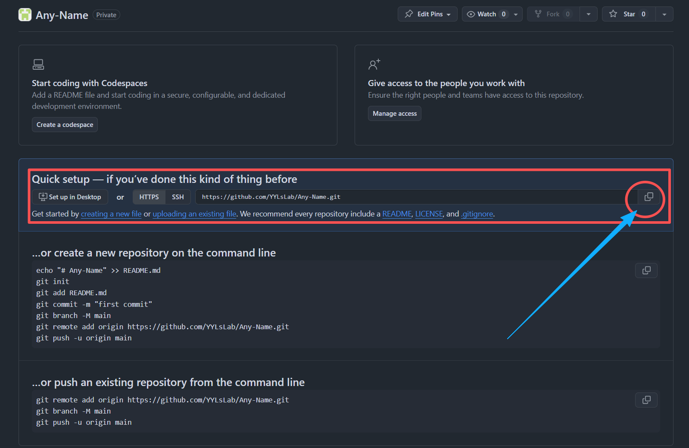
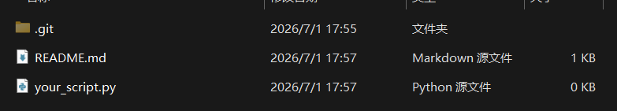
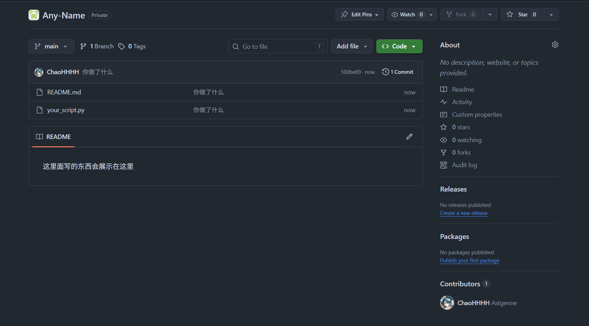

# 如何使用
## 首先安装好 `git` ，确保
```
(base) [17:48:58] @ LocalRepo $ git --version
git version 2.54.0.windows.1
```
## 接着看右下角，点击这里



## 然后 Create repository


## 然后点击此处，复制链接


## 回到本地终端，执行
```
(base) [17:49:03] @ LocalRepo $ git clone https://github.com/YYLsLab/Any-Name.git
Cloning into 'Any-Name'...
warning: You appear to have cloned an empty repository.
```

## 然后就能看到该文件夹，把要放的东西放进去


## README.md 会显示在Repository，可以把教程写进里面

## 接着执行
```
(base) [17:59:32] @ Any-Name $ git add .
(base) [17:59:36] @ Any-Name $ git commit -m "你做了什么"
[main (root-commit) 580be89] 你做了什么
 2 files changed, 1 insertion(+)
 create mode 100644 README.md
 create mode 100644 your_script.py
(base) [17:59:47] @ Any-Name $ git push
Enumerating objects: 4, done.
Counting objects: 100% (4/4), done.
Delta compression using up to 20 threads
Compressing objects: 100% (2/2), done.
Writing objects: 100% (4/4), 319 bytes | 319.00 KiB/s, done.
Total 4 (delta 0), reused 0 (delta 0), pack-reused 0 (from 0)
To https://github.com/YYLsLab/Any-Name.git
 * [new branch]      main -> main
```

## 查看 Github
